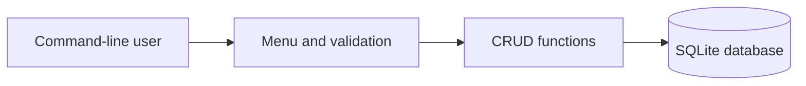

# Relational Database CRUD Application

A Python command-line application for managing student records in SQLite. It demonstrates relational schema design, parameterised SQL, persistent local storage, validation, and complete create, read, update and delete workflows.

This project represents my early database-development work. [FinFlow](https://github.com/zandiledladla/finflow-transaction-api) is its more advanced continuation, applying relational modelling to a layered FastAPI transaction-processing system with PostgreSQL and automated integration tests.

## Features

- Add validated student records
- List records in identifier order
- Update one or more fields without overwriting unchanged values
- Delete records by identifier
- Report when an update or deletion target does not exist
- Choose a database file through a command-line option
- Test CRUD logic using an isolated in-memory SQLite database

## Architecture



The menu collects input and reports outcomes. Reusable CRUD functions contain validation and parameterised SQL. SQLite provides the local relational database and creates the table automatically on startup.

## Technologies

- Python 3
- SQLite through Python's built-in `sqlite3` module
- SQL
- `unittest`, with optional `pytest` execution

## Run the application

```bash
git clone https://github.com/zandiledladla/relational-database-crud-app.git
cd relational-database-crud-app
python student_crud.py
```

Use a different database file when required:

```bash
python student_crud.py --database demo.db
```

The application creates the database and `students` table if they do not exist.

## Run the tests

The test suite uses an in-memory database and does not modify `students.db`:

```bash
python -m unittest discover -s tests -v
```

Alternatively:

```bash
python -m pip install -r requirements-dev.txt
python -m pytest
```

## Design decisions

- SQL values use placeholders instead of string interpolation.
- Database connections are passed to CRUD functions so behaviour is independently testable.
- Data is validated in Python and constrained in the database schema.
- The generated `.db` file is ignored because local data should not be committed to source control.
- The command-line interface keeps the project focused on database and backend fundamentals.

## Limitations

- The application is single-user and intended for local use.
- It does not provide authentication, authorisation, migrations, pagination or an HTTP API.
- Concurrent writes and production deployment are outside its scope.

## Example workflow

```text
Student Record Manager
1. Add student
2. View students
3. Update student
4. Delete student
5. Exit
Choose an option (1-5): 2

All students
1: Zandile | Age 23 | Computer Science
```

## Portfolio

Read the project case study at [https://zandiledladla.github.io](https://zandiledladla.github.io).
