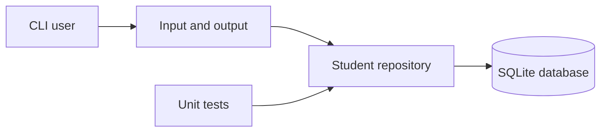

# Student Record Manager

A Python and SQLite application demonstrating relational persistence, parameterised SQL, validation and complete CRUD operations through a command-line interface.

## Engineering highlights

- Repository layer separates persistence from user interaction
- Parameterised queries protect SQL statements from input injection
- Database constraints and validation protect data integrity
- Context-managed transactions commit changes or roll back failures
- Dependency injection enables isolated in-memory tests
- Clear errors cover invalid input and missing records

## Architecture



## Run locally

Requires Python 3.10 or newer and no external packages.

```bash
python student_crud.py
```

The application creates `students.db` locally. Generated databases are excluded from version control.

## Run tests

```bash
python -m unittest -v
```

Tests use a fresh in-memory database and cover CRUD, validation and missing records.

## Scope

This is intentionally a focused CLI project. A production version would add authentication, schema migrations, structured logging and an API or web interface.

## Author

Zandile Dladla · [Portfolio](https://zandiledladla.github.io) · [GitHub](https://github.com/zandiledladla)
